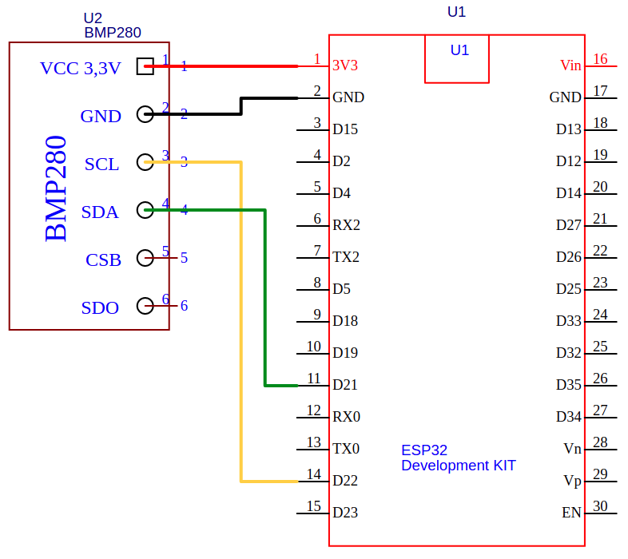

# BMP280 driver

To make the sensor interface to communicate with the ROS node, the ESP32 dev kit was used.

## The circuit

The BMP280 sensor was connected to the ESP32 dev kit as the following schematic shows:

The I2C connection between the sensor and the ESP32 dev kit are:
* D22 --> SCL
* D21 --> SDA

## The driver

This driver is responsible to read the sensor temperature and pressure measurements and send them to the computer via serial communication (USB).

## Libraries
* [Adafruit_Sensor](https://github.com/adafruit/Adafruit_Sensor)
* [Adafruit_BMP280_Library](https://github.com/adafruit/Adafruit_BMP280_Library)
    - Important: if the drive does not work and the sensor cannot be found, make an [I2C scan](https://playground.arduino.cc/Main/I2cScanner/) to find the sensor's address. In my case, the address is 0x76 while the default BMP280_ADDRESS on library is set to 0x77. To make it work I changed the address on library's code.

Both Libraries can be installed using the ManageLibrary on ArduinoIDE (Sketch>IncludeLibrary>ManageLibraries).